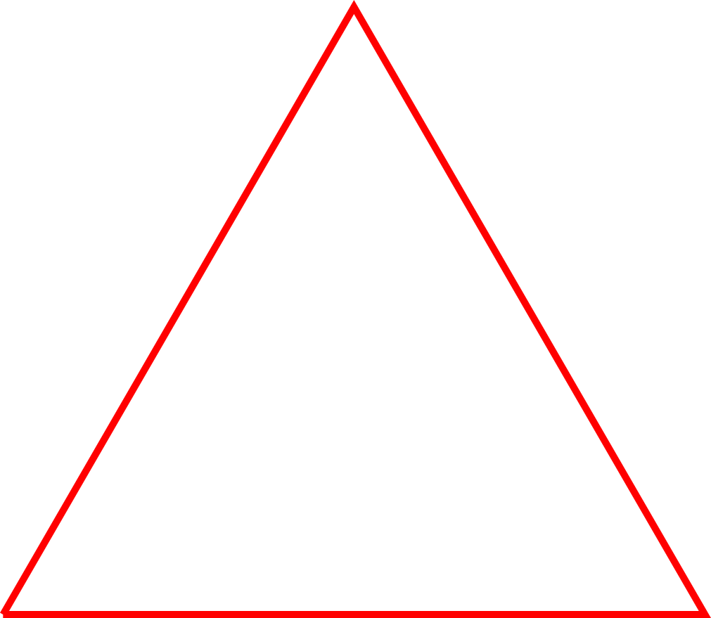
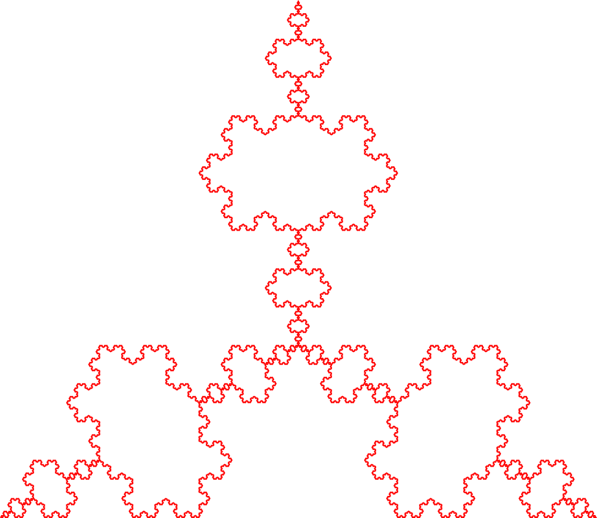
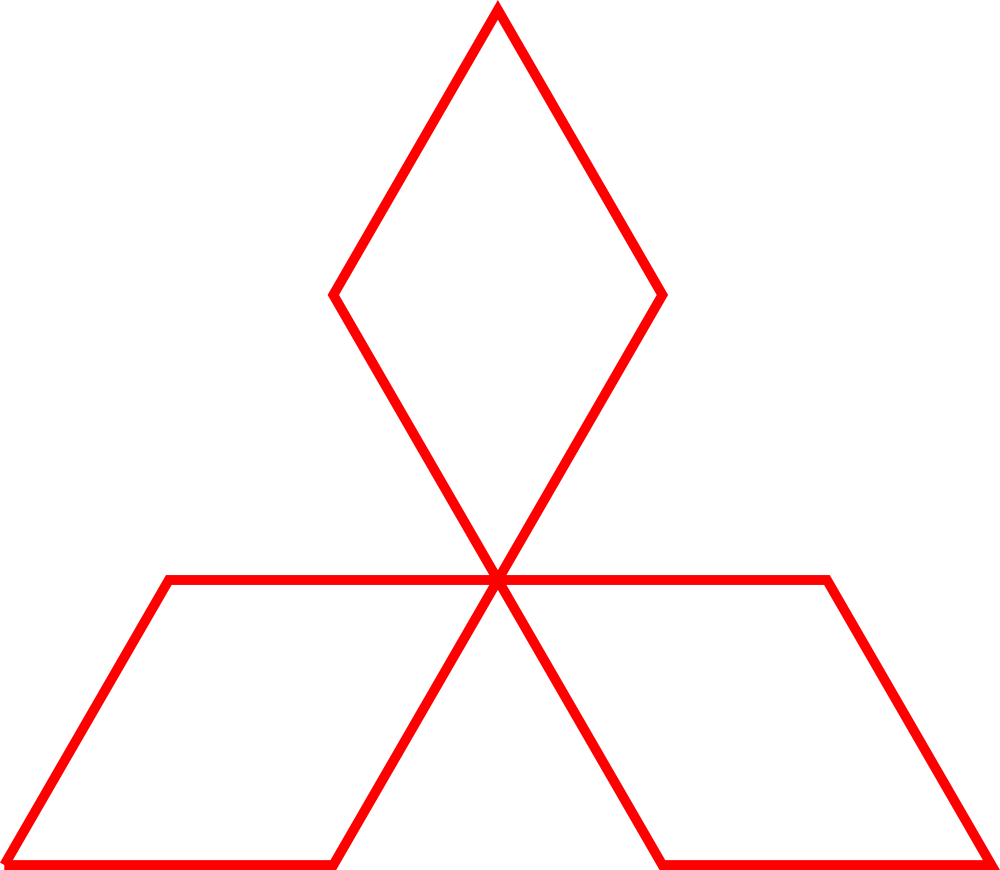

## Koch Curves

# This is a small python script that can generate the Koch Triangles also known as Snowflakes and save them to svg.

Below are some examples generated by the script:

And guess what? The mitsubishi logo is just an inverted Koch Triangle with 1 iteration step only

